# Bookshop

### Описание
Добро пожаловать! Здесь Вы можете ознакомиться с кодом для создания книжного интернет-магазина BookWorld

### Функционал сайта
**Главная страница:**  
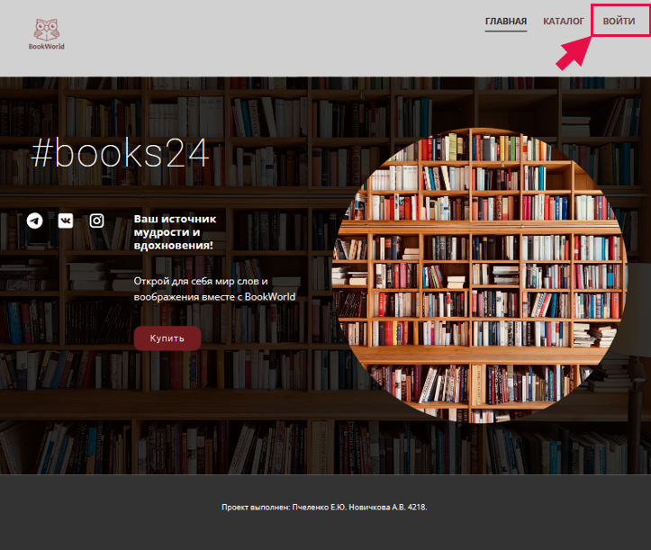  
**Страница авторизации:**  
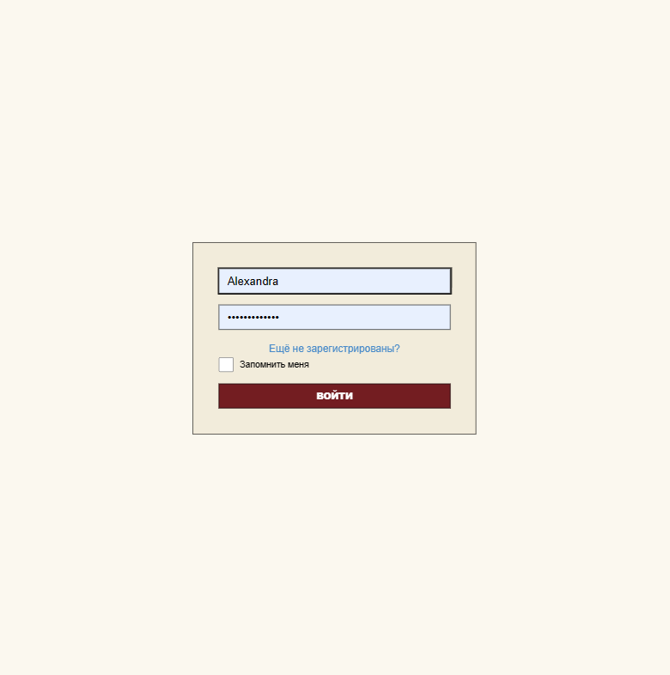  
**Страница регистрации:**  
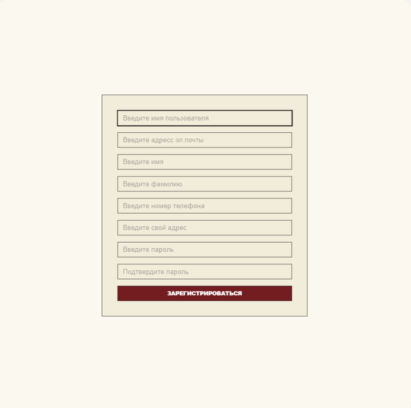  
**Cтраница с каталогом:**  
  
**Cтраница с фильтрацией каталога по жанрам:**  
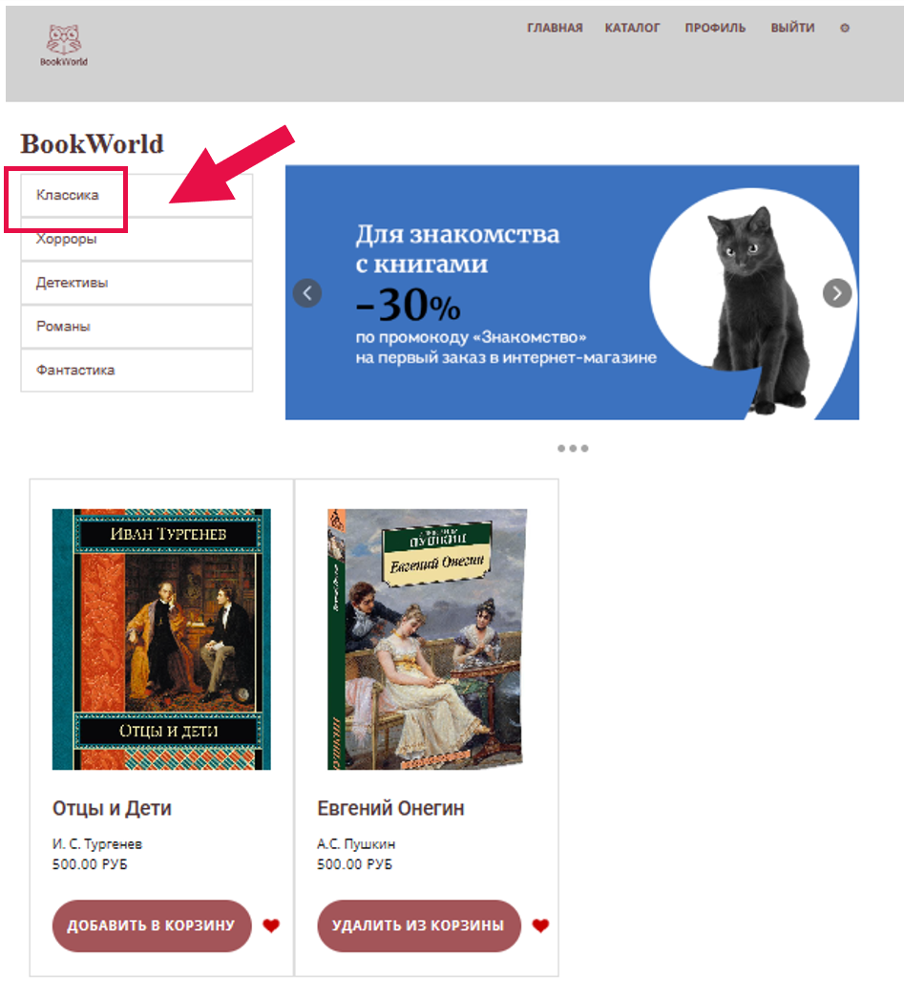  
**Страница с профилем:**  
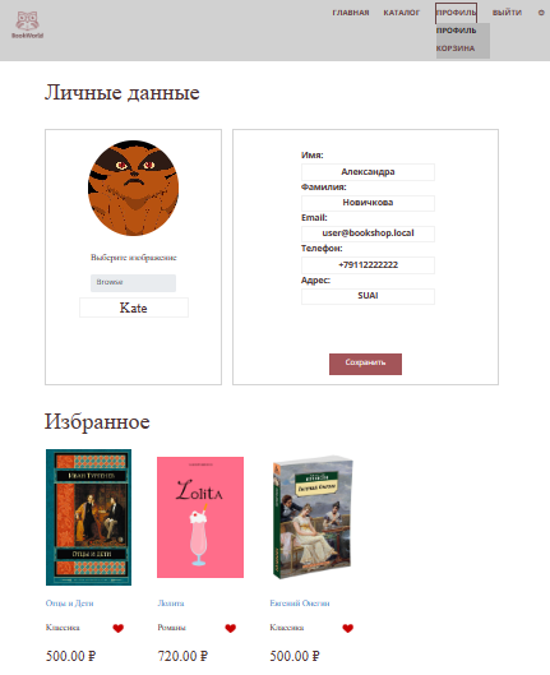  
**Страница с корзиной и заказами:**  
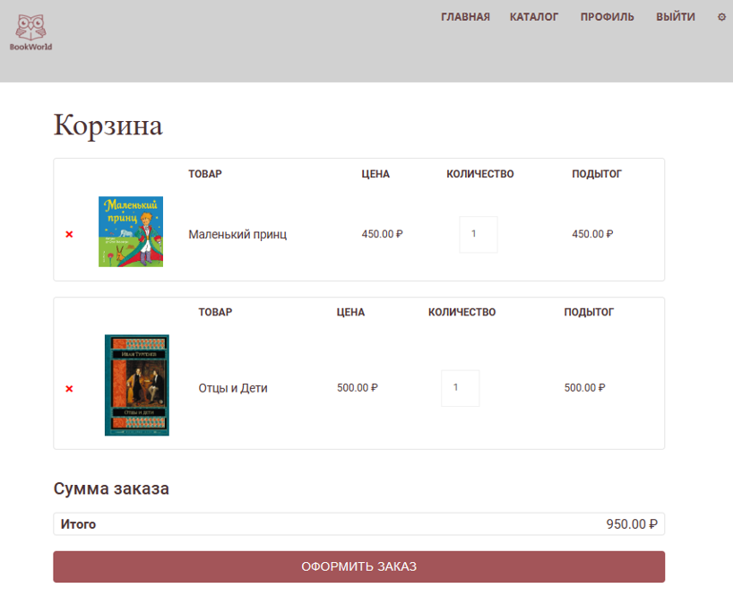  
**Заказы:**  
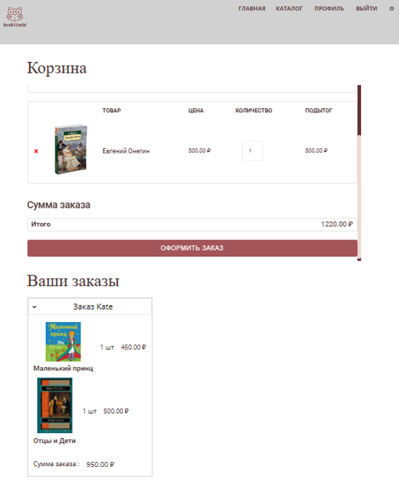  
**Оформление заказа:**  
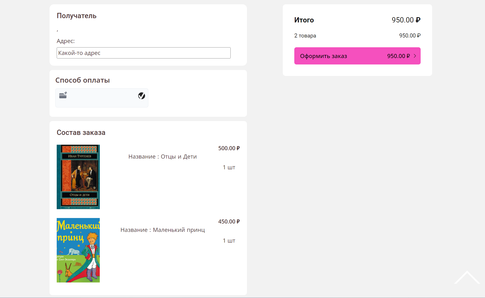  
**Админ-панель с пользователями:**  
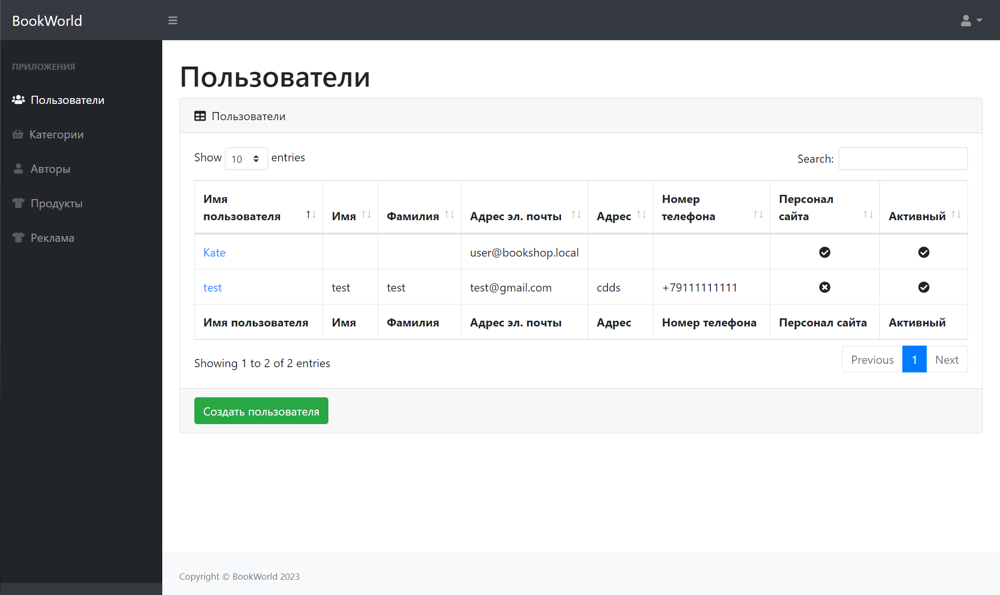  
**Админ-панель с жанрами:**  
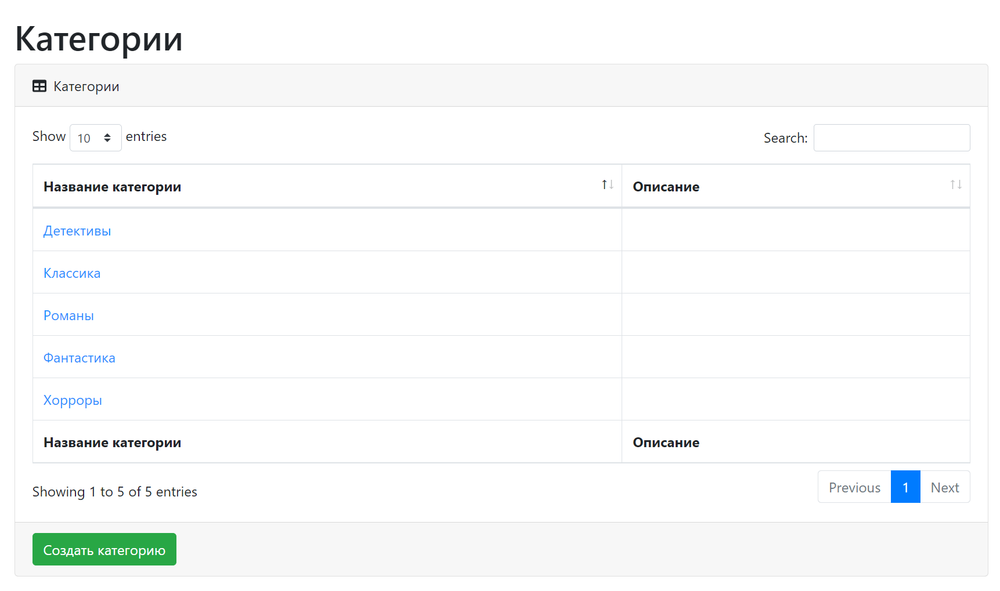  
**Редактирование в админ-панели:**  
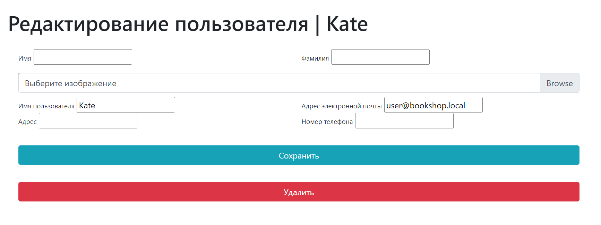  
**Админ-панель с книгами:**  
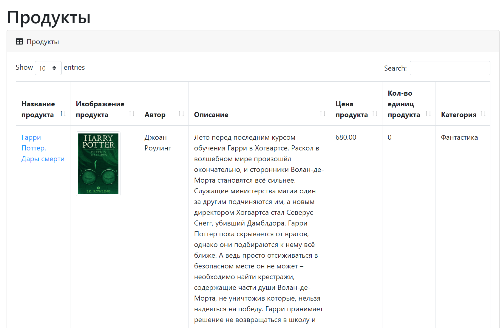  

### Инструкции по загрузке и запуску проекта
- Сделать форк репозитория
- Клонировать форк к себе на локальную машину командой (git clone *Ваш протокол http*)
- Открыть проект в редакторе
- Активировать виртуальное окружение командой (venv\Scripts\activate.bat - для Windows и source venv/bin/activate - для Linux и MacOS)
- Загрузите зависимости (pip install -r requirements.txt)
- Создайте миграции (python manage.py makemigrations (используйте утилиту python3 при работе с Linux и MacOS))
- Выполните миграциии (python manage.py migrate (используйте утилиту python3 при работе с Linux и MacOS))
- Заполните базу данных тестовыми данными (python manage.py fill_db (используйте утилиту python3 при работе с Linux и MacOS))
- Запустите сервер (python manage.py runserver (используйте утилиту python3 при работе с Linux и MacOS))
- Вы можете проверить работу сайта перейдя по адресу http://127.0.0.1:8000/

### Над проектом работали
Backend-разработчик: Пчеленко Екатерина (https://github.com/EkaterinaPchelenko)  
Frontend-разработчик: Новичкова Александра (https://github.com/AlexNovichkova)
